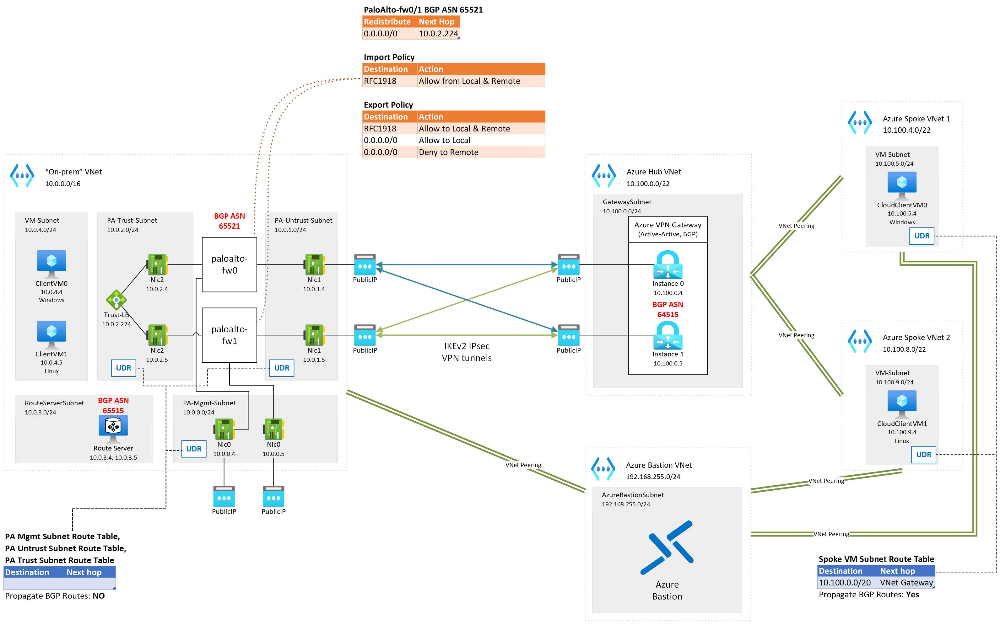
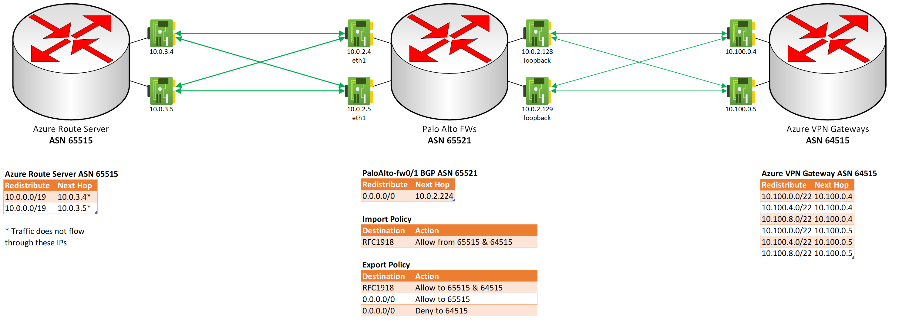

# Lab - Azure VPN Gateway Scenario: Active-Active gateways with highly available connections, using Palo Alto Firewalls

## Intro

The goal of this lab is to demonstrate and validate traffic flow between a simulated on-premises environment, running Palo Alto Networks firewall appliances at its edge, and an Azure cloud environment using self-managed hub and spoke networking. Dual redundancy is the target model of connectivity between the environments. See: ([Azure VPN Gateways: active-active dual redundancy](https://docs.microsoft.com/en-us/azure/vpn-gateway/vpn-gateway-highlyavailable#dual-redundancy-active-active-vpn-gateways-for-both-azure-and-on-premises-networks))

### Lab Diagram

The lab uses 1 VNET to simulate the on-premises environment where all Internet-bound traffic is routed through a pair Palo Alto firewalls at the edge. The cloud environment is comprised of a simple self-managed hub and spoke environment, with a shared VPN gateway at the hub. The Palo Alto firewalls are in a simulated Active-Active HA operating model, and the Azure VPN Gateway is configured as active-active for high availability as well. The on-premises environment and the cloud environment are connected to each other using site-to-site VPN and BGP. 

Azure Bastion is used for management access to the Client VMs in the on-prem and cloud environments. To minimize costs, a single Azure Bastion Basic SKU instance is created in a separate VNet, and directly peered to all VNets with VMs to be managed.

Also to minimize costs, the VMs are configured with an auto-shutdown schedule based on time of day. The exact time of day and time zone are configurable.

Below is a diagram of what you should expect to be deployed:



eBGP adjacencies are shown in detail below:



### Components

- Two hub VNets, one for on-prem and one for cloud, in two different regions (default Central US and West Central US respectively), where
    - The on-prem VNet has:
        - Two [PAN VM-Series Azure VMs](https://docs.paloaltonetworks.com/vm-series/10-2/vm-series-deployment/set-up-the-vm-series-firewall-on-azure) deployed in the BYOL model
            - These VMs are deployed using Palo Alto's default recommendation of 3 interfaces (Management, Untrust, and Trust)
            - UDRs are associated to the subnets of the Palo Alto VMs' network interfaces with BGP route propagation disabled (to prevent routing loops)
            - HTTPS remote management is enabled on the Management interface public IPs for your current public IP only; if you are running the deployment script in cloud shell, make sure to get the public IP of the system where you'll be logging into the PAN-OS web management interface from
            - licensing is beyond the scope of this lab, but the VMs will do what is needed to demonstrate the functionality without a license
        - A Route Server to simulate routes being exchanged inside the on-prem environment through BGP (note that Route Server speaks eBGP with its peers, so it's not a perfect representation)
            - This route server enables the Azure VNet on-premises environment to learn BGP routes from the Palo Alto Firewalls (in this example, the cloud Azure VPN Gateway is a BGP peer to the firewalls)
    - The cloud VNet has an Azure VPN Gateway deployed in Active-Active mode with BGP enabled
- Two spoke VNets in the same region as the cloud hub VNet, where:
    - The spoke VNets are peered directly to the cloud hub VNet
    - Transit between spoke VNets is achieved using the VPN Gateway; though this is not necessarily a valid practice in a live environment, depending on the circumstances, it is sufficient to provide transitive routing in this POC
- A separate VNet is deployed in the cloud region for remote access using Azure Bastion Basic SKU
    - All VNets with Azure VMs are directly peered to this Bastion VNet
    - This VNet provides no transitive routing, it is only for remote management access
- The local hub VNet has a Linux and Windows VM deployed for connectivity testing, accessible through Bastion or serial console
- The cloud spoke VNets each have a VM (one Linux, one Windows) deployed for connectivity testing, also accessible through Bastion or serial console
- The outcome of the lab will be full transit between all ends (all VMs can reach each other)
- BGP: The On-prem network's ASN is assigned to 65521. Azure Route Server currently uses ASN 65515, and the [ASN cannot be changed](https://docs.microsoft.com/en-us/azure/route-server/troubleshoot-route-server#why-does-my-nva-not-receive-routes-from-azure-route-server-even-though-the-bgp-peering-is-up). In order to avoid needing to force eBGP peers to learn certain routes from the same AS they use, the Azure VPN Gateway's ASN is configured as 64515.

### Deploy the lab

It is strongly recommended to download the entire lab's contents to a folder where you'll be doing the deployment. All dependencies assume you are in that folder as the current working directory. Once the environment is deployed there is a manual step required to configure the Palo Alto Firewalls using generated config XML files.

You can open [Azure Cloud Shell (bash)](https://shell.azure.com) and run the following commands to build the entire lab, though you will need to download the Palo Alto Firewall configs (*-import.xml) in order to upload them using the PAN-OS HTTPS management console.

```bash
git clone https://github.com/davmhelm/pafw-azvpngw-full-mesh-bgp.git 
cd ./pafw-azvpngw-full-mesh-bgp
source ./lab-deploy.azcli
```

**Note:** the provisioning process will take around 60 minutes to complete.

Alternatively (recommended), you can run step-by-step to get familiar with the provisioning process and the components deployed:
```bash
git clone https://github.com/davmhelm/pafw-azvpngw-full-mesh-bgp.git 
cd ./pafw-azvpngw-full-mesh-bgp


```

## Test Connectivity

The (lab-examine)[./lab-examine.azcli] script contains commands to check the effective routes on the deployed VMs, along with BGP routes advertised by/learned by the Route Server and VPN Gateway. There are also commands to test ICMP connectivity between VMs using Azure Network Watcher. 

Additionally, you can connect to the lab VMs using Azure Bastion to run your network tools of choice to validate connectivity (hping, traceroute, etc).

```bash

```

## Clean Up

Simply delete the resource groups created by lab-deploy.azcli script. You will be prompted for confirmation of each group's deletion.

```bash
az group delete --name $localSite_rg --force-deletion-types Microsoft.Compute/virtualMachines --no-wait
az group delete --name $cloudSite_rg --force-deletion-types Microsoft.Compute/virtualMachines --no-wait
```


Thanks to:
* https://github.com/jwrightazure/lab/tree/master/pan-vpn-to-azurevpngw-ikev2-bgp
* https://github.com/jwrightazure/lab/tree/master/PAN-BGP-ARS
* https://github.com/jwrightazure/lab/tree/master/VWAN-InternetAccess-Spoke-PaloAlto

## FAQ

### Why is the Azure Bastion VNet separate from all the other VNets? 
Couple of reasons:
1. It's less expensive to use one Bastion Basic SKU instance across the entire lab than one per-environment.
2. Having Bastion in its own VNet protects it from the 0.0.0.0/0 route advertisements being done in the on-prem VNet. 
    * An alternate approach would be to create an Azure Bastion Standard SKU instance in the cloud hub VNet and enable [IP-based connections](https://docs.microsoft.com/en-us/azure/bastion/connect-ip-address), which would allow you to connect to the VMs in the on-premises environment using their Private IPs. 
        * The lab configuration is designed to prevent this, but in a real environment you must ensure that the default route (0.0.0.0/0) is not learned from on-prem, or your ability to use the Bastion instance will be broken until you fix the routing.
        * Configuring BGP route filtering is beyond the scope of this lab, but in the context of Palo Alto I found these articles helpful:
            * [PAN Docs: How to configure BGP](https://docs.paloaltonetworks.com/pan-os/10-1/pan-os-networking-admin/bgp/configure-bgp)
            * [PAN KB: How to configure BGP route filtering](https://knowledgebase.paloaltonetworks.com/KCSArticleDetail?id=kA10g000000ClDuCAK)
            * [PAN KB: How to import/export a default route using BGP](https://knowledgebase.paloaltonetworks.com/kcSArticleDetail?id=kA10g000000CltU)
    * As of this writeup there is no way to protect the AzureBastionSubnet from learning routes that would impede its functionality/put it into an unsupported state.
### Why do we need to change the ASN away from the default on the Azure VPN Gateway (65515)?
- In some circumstances it's normal for eBGP peers to receive route advertisements with an [AS Path](https://datatracker.ietf.org/doc/html/rfc4271#section-5.1.2) containing their own ASN, and during [Phase 2 of the Decision Process](https://datatracker.ietf.org/doc/html/rfc4271#section-9.1.2) make their own decision on whether to incorporate the routes in their [Routing Information Base (RIB)](https://en.wikipedia.org/wiki/Routing_table). 
- Though it is beyond the scope of this document: with Palo Alto Firewalls, there is an optional feature enabled that causes the sender to detect the loop pre-emptively and not send over the route at all. More info:
    - [PAN Docs: Sender Side Loop Detection](https://docs.paloaltonetworks.com/pan-os/10-1/pan-os-networking-admin/bgp/configure-a-bgp-peer-with-mp-bgp-for-ipv4-or-ipv6-unicast#:~:text=when%20you%20enable%20sender%20side%20loop%20detection%2C%20the%20firewall%20will%20check%20the%20as_path%20attribute%20of%20a%20route%20in%20its%20fib%20before%20it%20sends%20the%20route%20in%20an%20update%2C%20to%20ensure%20that%20the%20peer%20as%20number%20is%20not%20on%20the%20as_path%20list.%20if%20it%20is%2C%20the%20firewall%20removes%20it%20to%20prevent%20a%20loop)
    - [PAN KB: BGP advertisements through an eBGP peer not occurring between two peers in the same AS](https://knowledgebase.paloaltonetworks.com/KCSArticleDetail?id=kA10g000000ClyqCAC)
    - [PAN Community: BGP advertising prfix to same AS it was learned from](https://live.paloaltonetworks.com/t5/general-topics/bgp-advertising-prefix-to-same-as-it-was-learned-from/m-p/145383)
